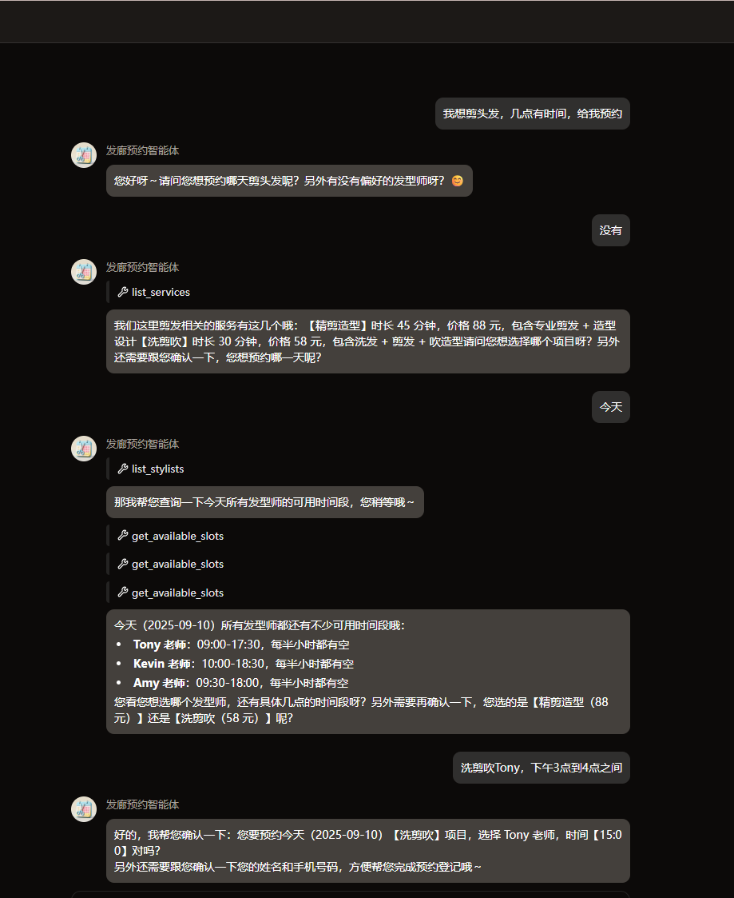

# Salon Booking Agent

基于 LangGraph + Coze 平台的 AI 美发沙龙预约助手。Agent 化身前台"小美"，通过自然语言对话帮助顾客查询服务、发型师、预约时间，并完成预约、查询和取消操作。

## 效果演示

### 预约流程



### 对话交互


## 技术栈

| 组件 | 技术 |
|------|------|
| AI 框架 | LangChain + LangGraph |
| LLM | 豆包 Seed 2.0 Lite（OpenAI 兼容 API） |
| Web 框架 | FastAPI + Uvicorn |
| 数据库 | PostgreSQL（Supabase 客户端 + SQLAlchemy ORM） |
| 记忆/检查点 | LangGraph PostgresSaver（MemorySaver 兜底） |
| 文件存储 | S3 兼容存储（boto3） |
| 平台 | Coze |
| 包管理 | uv（阿里云镜像） |

## 项目结构

```
salon-booking-agent/
├── config/                     # 配置文件
│   └── agent_llm_config.json   # LLM 模型参数 & 系统提示词
├── scripts/                    # 运行脚本
│   ├── http_run.sh             # 启动 HTTP 服务
│   ├── local_run.sh            # 本地运行（flow/node/agent 模式）
│   ├── setup.sh                # 安装依赖
│   ├── pack.sh                 # 依赖锁定（打包用）
│   └── load_env.sh/py          # 加载 Coze 平台环境变量
├── src/
│   ├── main.py                 # 入口：FastAPI 应用 & GraphService 编排
│   ├── agents/
│   │   └── agent.py            # Agent 定义（状态、工具、检查点、系统提示）
│   ├── graphs/                 # 工作流图（预留）
│   ├── tools/
│   │   └── appointment_tools.py # 7 个预约工具（服务/发型师/时段/预约/查询/取消）
│   ├── storage/
│   │   ├── database/           # 数据库（SQLAlchemy 模型 + Supabase 客户端）
│   │   ├── memory/             # LangGraph 检查点（PostgresSaver / MemorySaver）
│   │   └── s3/                 # S3 文件存储
│   └── utils/
│       └── file/               # 文件处理工具
├── docs/images/                # 文档图片
├── pyproject.toml              # 项目依赖配置
└── README.md
```

## Agent 工具能力

Agent 共提供 7 个工具，与 Supabase (PostgreSQL) 数据库交互：

| 工具 | 说明 |
|------|------|
| `list_services` | 查询可用服务（名称、时长、价格、描述） |
| `list_stylists` | 查询在职发型师（姓名、电话、工作时间） |
| `get_available_slots` | 查询指定发型师在指定日期的可用时段 |
| `create_appointment` | 创建预约（检查时间冲突后插入） |
| `query_appointments` | 查询预约记录（按手机号/日期筛选） |
| `cancel_appointment` | 取消预约（软删除，状态改为 "cancelled"） |
| `get_stylist_services` | 查询某位发型师提供的服务列表 |

## 本地运行

### 安装依赖

```bash
bash scripts/setup.sh
```

### 运行流程（一次性执行）

```bash
bash scripts/local_run.sh -m flow
```

### 运行单个节点

```bash
bash scripts/local_run.sh -m node -n <node_name>
```

### 启动 HTTP 服务

```bash
bash scripts/http_run.sh -m http -p 5000
```

## HTTP API

| 端点 | 方法 | 说明 |
|------|------|------|
| `/run` | POST | 同步执行 Agent |
| `/stream_run` | POST | 流式 SSE 响应 |
| `/async_run` | POST | 异步提交任务 |
| `/task/{task_id}` | GET | 查询异步任务状态 |
| `/cancel/{run_id}` | POST | 取消运行中的任务 |
| `/node_run/{node_id}` | POST | 运行单个图节点 |
| `/v1/chat/completions` | POST | OpenAI 兼容 Chat API |
| `/health` | GET | 健康检查 |
| `/graph_parameter` | GET | 获取输入/输出 JSON Schema |

## License

MIT
